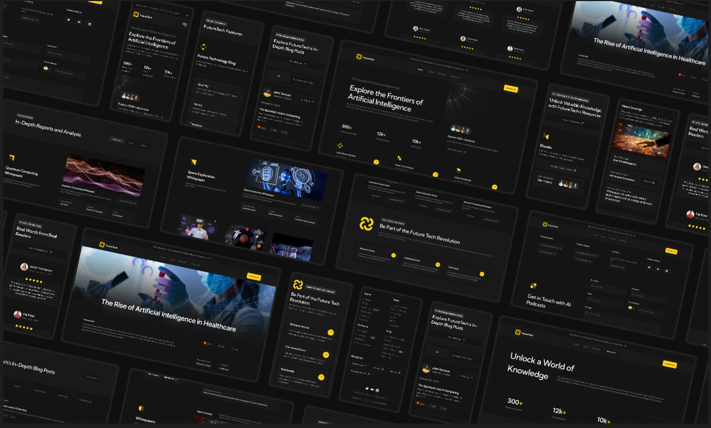

# 📌Future-Tech

A multi-page website for a fictitious company working in the field of artificial intelligence.
Developed using HTML, SCSS, JavaScript. The site is fully responsive and includes interactive elements.

## 🔗DEMO

👉[View Live Website](https://ramzilasadullinxd.github.io/Future-Tech/)

## 🛠️Technology

- HTML5  
- SCSS (Flexbox/Grid, adaptability and 
file structure)  
- JS (video player, select, form and the like)  

## 📷 Screenshot

## 🚀 Features

- Cross-browser layout
- Mobile adaptation
- simple js logic: video, select, form and the like
- Clean and modular SCSS architecture

## 📁 Installation and launch

If you want to run it locally:

- git clone https://github.com/RamzilAsadullinXd/Future-Tech
- cd Future-Tech
- open index.html in browser

## 👤 Аfter
- Developer: Ramzil Asadullin
- telegram "@AsadullinRamzil"
- Gmail "asadullinramzil0@gmail.com"
